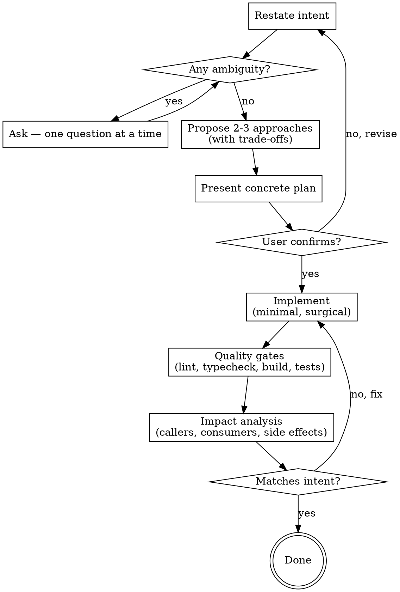

# Requirements-Driven Development

> **OVERRIDES brainstorming for code modification tasks.** When triggered alongside brainstorming, this skill takes precedence. brainstorming handles new-project design and ideation; this skill handles adding/changing/refactoring code.

## ⛔ 互锁门禁（与其它 Skill 的边界）

本 Skill 与以下 Skill 互斥，按优先级触发：

| 优先级 | 触发条件 | 执行 Skill |
|:---|:---|:---|
| 最高 | 用户说"移植/迁移/migrate/port" | `code-migrater`（其他 Skill 静默） |
| 次高 | 用户说"报错/不对/不工作/返回错误/显示不对/空列表"等不符合预期的行为 | `diagnose-before-fix`（若同时含"移植"关键词，让位于 code-migrater） |
| 最低 | 用户说"添加/新增/实现一个新功能" | `requirements-driven-dev`（若同时含"修/不对/报错"，让位于 diagnose-before-fix） |

**纯知识问答（如"这个 API 怎么用"）不触发任何 Skill。**

## 触发条件

**仅在以下情况触发：**
- 用户说"添加/新增/实现/加个"一个新功能/新模块/新接口
- 用户说"我想要一个...功能"、"帮我做一个..."
- 用户说"加个页面"、"加个接口"、"加个组件"

**不触发的情况：**
- 用户说"移植/迁移"（走 `code-migrater`）
- 用户说"报错/不对/不工作/返回错误"（走 `diagnose-before-fix`）
- 用户说"改一下/修一下/重构"已有代码（走 `diagnose-before-fix` 或普通对话）

## Overview

**Understand the intent. Verify the result.** Every modification task runs a mandatory three-phase cycle. No phase is optional. "Simple" changes are where unexamined assumptions cause the most waste.

```
CLARIFY → IMPLEMENT → VERIFY
```

## Workflow

### 强制契约：与项目知识中枢（project-docs MCP）的交互

**执行前：上下文已由路由器通过 MCP 注入**

路由器已在分发前调用了 `project-docs.query_docs`，相关文档摘要已包含在输入中。

如果未收到注入的上下文：
1. 主动调用 MCP 工具 `project-docs.query_docs`，关键词根据当前任务提取。
2. 使用返回结果作为上下文。

**执行后：必须通过 MCP 写回**

任务完成后，必须调用 `project-docs` MCP 工具更新文档：

| 场景 | 调用的工具 | 说明 |
|:---|:---|:---|
| 新增了架构决策 | `create_adr` | 记录决策 |
| 新增/修改了 API | `update_doc` | 更新 API 规范 |
| 新增了模块 | `update_doc` | 更新模块划分 |
| 新增了 UI 组件 | `update_doc` | 更新组件设计规范 |

**违反此契约视为违规，任务不计为完成。**



## Phase 1: CLARIFY

### 0. 模式检测

检测当前处于 Plan 模式还是 Build 模式。

#### 如果在 Plan 模式下：

**你的职责是：理解需求 → 输出实现计划 → 指引切换**

执行：
1. 复述用户需求，澄清模糊点。
2. 阅读相关代码，理解现有架构。
3. 提出 2-3 种实现方案及优缺点。
4. 用户确认方案后，**输出详细的实现计划**，包括：
   - 新增/修改哪些文件
   - 每个文件的职责和关键代码结构
   - 测试验证点
5. **在计划末尾输出模式切换指引**（参见 `../shared/mode-switch-guide.md`）。

#### 如果在 Build 模式下：

直接按以下原流程执行，无需额外步骤。

---

Before touching any code. This phase ends ONLY when you have zero unanswered questions.

### 1.1 Restate Intent

In your own words — what is being asked, why, and what the expected outcome looks like.

### 1.2 Locate Relevant Code (for modifications)

If the request involves modifying existing functionality, **read the relevant code before asking clarifying questions.** Search for the module/feature, understand its current structure, and have it in context. Questions asked without understanding the existing code are shallow and waste the user's time.

### 1.3 Exhaust Clarification

Ask clarifying questions **one at a time**. Probe until nothing is ambiguous:

- **Scope**: What exactly changes? What must NOT change?
- **Behavior**: Input/output, edge cases, error handling, states
- **Constraints**: Performance, compatibility, dependencies
- **Priority**: What's required vs nice-to-have

<HARD-GATE>
Do NOT present a plan until you have exhausted ALL clarifying questions. "I think I understand enough" is a violation. If there is even ONE unanswered question about scope, behavior, or constraints, you are NOT ready to present a plan.
</HARD-GATE>

### 1.4 UI Mockup (for frontend/visual work)

If the change involves frontend UI or any visual output, **draw a schematic before discussing implementation approach.** Use ASCII diagrams, mermaid, or markdown tables to show layout, component hierarchy, and interaction flow. Get user confirmation on the visual design first.

### 1.5 Propose Approach

When (and only when) clarification is complete, propose 2-3 approaches with trade-offs and your recommendation. This should be brief — a few sentences per option.

### 1.6 Present Plan & Get Confirmation

Only after the approach is agreed, present the concrete plan:
- Which files? What approach? What order? What risks?

Do not write a single line of code until the user confirms the plan.

### Anti-Pattern: "I Understand Enough"

| Excuse | Reality |
|---------|---------|
| "The rest is obvious" | If it were obvious, you wouldn't need clarifying questions at all |
| "I'll figure out details during implementation" | Unresolved questions lead to wrong implementations |
| "They'll tell me if something is wrong" | Making the user catch gaps you should have asked about is not acceptable |
| "This is simple, I don't need to ask more" | Simple changes hide the most assumptions |

**Red Flags — stop and go back to clarification:**
- You're about to present a plan but still have open questions
- You're guessing what the user meant
- The user's request is ambiguous and you haven't asked
- "I think they mean…" — that means ask

## Phase 2: IMPLEMENT

### 2.1 选择实施方式

在拆包后，评估任务规模，向用户提供实施方式选项：

```markdown
## 实施方式评估

| 方式 | 适用场景 | 本次是否适用 |
|:---|:---|:---|
| **当前会话直接写** | 改动 ≤2 个文件，逻辑简单，相互依赖紧密 | [待评估] |
| **Subagent 并行** | 改动 ≥3 个独立文件/模块，互不依赖，可并行生成 | [待评估] |

**我的评估**：[根据拆包结果说明理由]
**推荐**：[推荐一种方式]
```

**触发 Subagent 并行的硬性条件（必须全部满足）：**
1. 原子包数量 ≥3
2. 原子包之间**无文件级依赖**（不读写同一个文件）
3. 每个原子包是**纯新增代码**，不修改已有复杂逻辑

**不满足以上任一条件时，默认使用"当前会话直接写"。**

### 2.2 Break Down into Steps

From the confirmed plan, break the work into small, verifiable steps. Each step should be independently buildable and testable.

Create a **todo list** with every step. Update todo status in real time — mark `in_progress` when working, `completed` when verified. Only one step `in_progress` at a time.

### 2.3 Git Checkpoint Before Each Step

Before modifying any code for a step:

```bash
git add -A; git commit -m "checkpoint: [step description]"
```

If the step fails verification, `git reset --hard <checkpoint-hash>` to roll back cleanly.

### 2.4 Dispatch Subagents（仅当用户选择"Subagent 并行"时）

**启动条件**：用户已确认选择 Subagent 并行模式，且满足上述硬性条件。

**执行方式**：
- 主控为每个原子包启动一个独立的 `CodeGen Subagent`（临时生成器，非 `code-migrater` 的 Translator）。
- 每个 Subagent 的输入：`需求描述 + 目标项目架构约定`
- 每个 Subagent 的输出：`新文件完整代码 + 简要说明`
- 并行度上限：**3**
- 主控等待所有 Subagent 返回后，统一做编译检查。

**与 `code-migrater` Subagent 的区别**：
- `code-migrater` Translator：输入是**源文件**，输出是**翻译后的目标文件**，依赖 `MAPPING_TABLE.yaml`。
- RDD CodeGen：输入是**需求描述**，输出是**从零生成的新文件**，不依赖映射表。

**禁止行为**：
- 禁止用 RDD 的 CodeGen Subagent 做跨项目移植。
- 禁止用 RDD 的 CodeGen Subagent 修改已有代码（只能新增）。

### 2.5 Per-Step Discipline

For each step:
- **Implement**: minimal code, surgical, match existing conventions
- **Verify**: lint → typecheck → build → run relevant tests for this step
- **If fail**: diagnose with diagnose-before-fix, fix, re-verify
- **Mark todo**: completed only after verification passes

### 2.6 Final Integration Review

After ALL subagents complete and ALL steps pass verification:

1. **Cross-check**: Do changes from different steps interact correctly?
2. **Consistency**: Same conventions, no duplicate code, no conflicts
3. **Completeness**: Every item from the confirmed plan is done
4. **Update todo**: all items `completed`

Only then proceed to Phase 3 VERIFY.

## Phase 3: VERIFY

Build passing is NOT "done." Verification must prove the code actually works.

### 3.1 Quality Gates — Execute, Don't Assume

**必须实际运行，不是肉眼检查:**

1. **Lint** — run the project's lint command, fix all issues
2. **Typecheck** — run the project's type checker
3. **Build** — run the build command, confirm zero errors
4. **Tests** — run existing tests. All must pass. If the project has no tests, explicitly note that.

```
编译通过 ≠ 代码能跑
grep/阅读代码 ≠ 验证
```

### 3.2 Propose Test Scenarios

主动提出针对本次改动的测试场景:

```markdown
## 建议验证点

1. **[正常场景]** — 输入: `...`，预期: `...`
2. **[边界场景]** — 输入: `...`，预期: `...`
3. **[异常场景]** — 输入: `...`，预期: `...`
```

### 3.3 Execute & Compare

将测试场景实际执行（若可自主运行）或将测试命令提供给用户。对比实际结果与预期结果。

**若新功能涉及后端 API 验证**：
- 参考 `../shared/services.md` 的标准操作流程启动服务。
- 验证完成后，主动向用户询问是否需要保持服务运行，否则自动清理。

### 3.4 Impact Analysis

- 谁调用了这段代码？搜索结果必须输出
- 这段代码依赖什么？改动是否破坏了下游？
- 有没有你没注意到的副作用？

### 3.5 Intent Match

把最终结果与 Phase 1 的澄清逐条对比。不符合就修。

### Verification Failure Protocol

**任何验证失败时:** 使用 diagnose-before-fix — 诊断根因 → 枚举可能原因 → 用户确认方向 → 修复 → 重新验证。

## Completion Checklist (Hard Gate)

以下 **全部** 满足才叫完成:

- [ ] Lint 通过
- [ ] Typecheck 通过
- [ ] Build 通过
- [ ] 现有测试全部通过
- [ ] 测试场景已提议并验证
- [ ] 影响分析已执行，无遗漏
- [ ] 结果与 Phase 1 意图匹配

**任何一项未完成，禁止说"做完了"。**

## Common Mistakes

| Mistake | Fix |
|---------|-----|
| Presenting plan before exhausting all questions | HARD-GATE: zero unanswered questions before plan |
| Build passed = done | Build is checkpoint 3 of 7. Tests and intent match still required. |
| Coding before clarifying intent | Phase 1 is mandatory |
| Skipping tests ("改这么点不会有问题") | All gates, every change — simple changes cause the dumbest bugs |
| Adding unrequested features | Stick to the confirmed plan |
| Assuming no side effects | Check callers and consumers |
| "I know what they mean" | Restate anyway. You might be wrong. |
| Tests as optional suggestion | Tests are mandatory. Propose scenarios, execute, compare. |
| grep/read instead of actually running | 肉眼验证 ≠ 编译器/运行时验证 |

## 速查：禁止事项

- 用 RDD Subagent 做跨项目移植（必须走 code-migrater）
- 用 RDD Subagent 修改已有业务逻辑（只能新增）
- 改动 ≤2 个文件时启动 Subagent（杀鸡用牛刀）
- 跳过 Phase 1 澄清直接写代码
- Build 不跑就声称完成
- 测试不实际执行，只做肉眼检查
- 执行前不向 project-docs 请求上下文（违反强制契约）
- 执行后不向 project-docs 写回信息（违反强制契约）
- 绕过 project-docs 直接读写 `docs/junsi-dev-docs/` 下的文档
- 有 MCP 可用时不使用，手动维护文档
- 执行完成后不通过 MCP 写回信息

## When NOT to Use

- Pure information questions ("how does X work?")
- Trivial edits where intent is 100% unambiguous
- User explicitly says "skip the planning, just do it"
- Bug fixes or error diagnostics — use `diagnose-before-fix`
- Cross-project migration — use `code-migrater`
